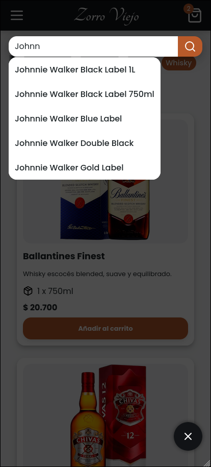
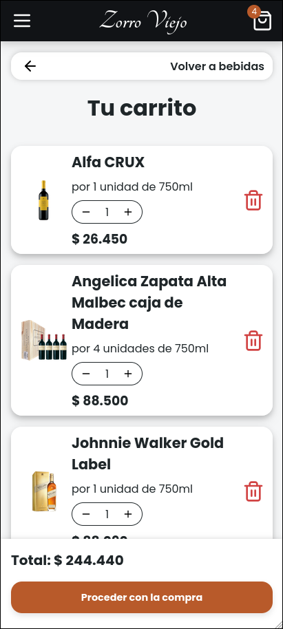

# Zorro Viejo Beverages E‑commerce

> 🚧 **Work in progress:** This project is under active development. The available demo is not production ready, and it is for showcase purposes only. You’ll see mock data and placeholders.

**A freelance project**: e-commerce platform for buying alcoholic beverages. This project aims to deliver a clean, mobile‑first shopping experience for customers and a user‑friendly interface for the admin, keeping the product catalog always up to date. Per client requirements, the checkout flow replaces a traditional payment gateway with WhatsApp redirection, while maintaining internal order tracking for reliability.

**Live demo:** [_work-in-progress demo available here._](https://zorro-viejo.vercel.app/)

<table>
  <tr>
    <td></td>
    <td></td>
  </tr>
  <tr>
    <td></td>
    <td></td>
  </tr>
</table>

## Features

- Mobile‑first, fully responsive design
- Product filtering by category
- Pagination
- Loading skeletons during data fetch
- Product search by name
- Snackbars for “add to cart” feedback
- Product detail view with image carousel for multiple images
- Related products carousel in product detail view
- Persistent shopping cart (global state via Zustand)
- Cart badge counter
- Checkout flow with WhatsApp redirection (pre‑filled order message)
- QR code for WhatsApp redirection in checkout success view
- Order creation and storage via Supabase + TanStack Query
- Advanced form validation with React Hook Form + Zod resolver
- Admin authentication with Supabase + refine.dev
- Protected routes with admin guard (redirect to login if unauthenticated)
- Internal order tracking (admin only)
- Data fetching using TanStack Query hooks + Supabase API
- Type‑safe models with Zod schemas and TypeScript
- API response transformation to local models via Zod
- User-friendly fetch error handling with retry button
- Global error handling via Error Boundaries (error view with retry button and contact link for unrecoverable errors)
- AG Grid for admin data tables (orders and products)

## Tech Stack

**Core & Tooling:**

- React
- TypeScript
- Zod
- Vite
- ESLint
- Prettier
- bun (as package manager)

**Data & State:**

- Supabase
- TanStack Query
- Zustand

**UI & Styling:**

- CSS Modules
- Radix UI
- Embla Carousel
- React Loading Skeleton
- Lucide React Icons

**Others:**

- React Hook Form (with zod resolver)
- React Router
- refine.dev
- usehooks-ts
- qrcode.react
- AG Grid

## Installation

### 1. Clone the repository

```bash
git clone https://github.com/fran-dv/zorro-viejo.git

# cd into the project directory
cd zorro-viejo
```

### 2. Install dependencies

```bash
bun install
```

### 3.Configure environment variables

- Create a Supabase account and project to obtain your credentials.
- If your databases schemas differ from the ones in this project, update the Zod schemas in src/models.
- In the project root, create a .env.local file containing:

```bash
VITE_SUPABASE_URL=your_supabase_url
VITE_SUPABASE_ANON_KEY=your_supabase_anon_key
VITE_WHATSAPP_REDIRECT_NUMBER=your_phone_number
```

### 4. Run the development server

```bash
bun run dev # or `bun run dev --host 0.0.0.0` for network exposure
```

### 5. Open the app

Visit http://localhost:5173 (or http://<your-ip>:5173 from another device) in your browser.

---

_Built with 💚 by Francisco Della Vedova_
📧 franciscodellav@gmail.com • 💼 [Linkedin](https://www.linkedin.com/in/francisco-della-vedova-702154316/) • 🔗 [Github](https://github.com/fran-dv)
